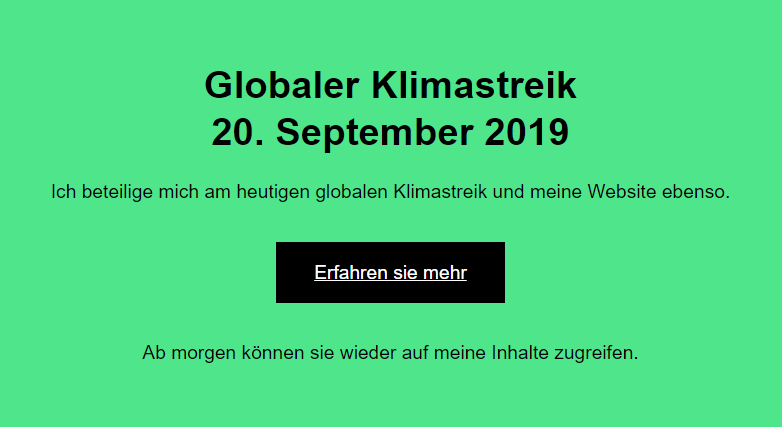

# Climatestrike

A WordPress plugin to temporarily disable the website for the Global Climate Strike on 20 September 2019.

The plugin disables the entire website and returns a placeholder page along with HTTP code 302 Moved temporarily for the global climate strike day at 20 September 2019. The placeholder is a simple HTML page, leave-in /assets/placeholder.html. The placeholder page is available in English or German language. The language settings of the page controls the output. The fallback if the placeholder page in this language is not available in English (`en`). 

It is possible to exclude pages from the replacement, initial only the page with the slug `/impressum/` and all users there are logged in. You should use the filter hook `climatestrike.excludes` to change or enhance the pages to exclude. 

The plugin have no settings UI, has the focus for this day and leave no data inside the WordPress installation.

## Usage
### Requirements
 * WordPress
 * PHP 7

Install static via download, clone the repository or use dependency management via Composer.

## Kudos
* Inspired by [digital.globalclimatestrike.net](https://digital.globalclimatestrike.net/)
* [Global Climatestrike](https://globalclimatestrike.net)
* Placeholder Markup by [Sebastian Greger](https://github.com/sebastiangreger)

## License
Copyright (c) 2019, [Frank Bültge](https://bueltge.de)

Good news, this plugin is free for everyone! Since it's released under the [GPL License](./LICENSE) you can use it free of charge on your personal or commercial website.

## Contributing

 * [GitHub Repository](https://github.com/bueltge/climatestrike)

All feedback / bug reports / pull requests are welcome.

---
